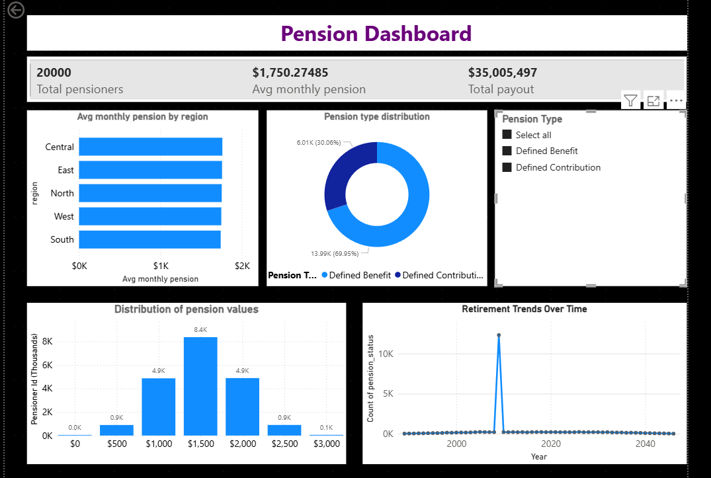

# 🧾 Pension Management System Analysis

_Analyzing pension management system to simulate a real-world pension administration workflow using Python, SQL, and Power BI._

---

## 📌 Table of Contents
- <a href="#overview">Overview</a>
- <a href="#business-problem">Business Problem</a>
- <a href="#dataset">Dataset</a>
- <a href="#tools--technologies">Tools & Technologies</a>
- <a href="#project-structure">Project Structure</a>
- <a href="#data-cleaning--preparation">Data Cleaning & Preparation</a>
- <a href="#exploratory-data-analysis-eda">Exploratory Data Analysis (EDA)</a>
- <a href="#research-questions--key-findings">Research Questions</a>
- <a href="#dashboard">Dashboard</a>
- <a href="#how-to-run-this-project">How to Run This Project</a>
- <a href="#final-recommendations">Final Recommendations</a>
- <a href="#author--contact">Author & Contact</a>

---
<h2><a class="anchor" id="overview"></a>Overview</h2>

The Pension Management System is a three-phase end‑to‑end data project that includes data ingestion, transformation, storage, analysis, and visualization. The project aims to simulate a real-world pension administration workflow using Python, SQL, and Power BI.

---
<h2><a class="anchor" id="business-problem"></a>Business Problem</h2>

This project aims to:
- Design and implement an end-to-end Pension Management System that simulates real-world pension administration workflows.
- Ensure data accuracy by recalculating years of service using employment timelines to resolve inconsistencies in pension records.
- Automate data ingestion, cleaning, transformation, and validation using Python ETL processes.
- Protect sensitive information by masking personal and financial data in compliance with data privacy principles.
- Store validated pension data in a structured database to enable efficient querying and analysis.
- Perform SQL-based analysis to identify payout trends, retirement patterns, and regional pension distributions.
- Deliver interactive Power BI dashboards that provide clear insights into pension liabilities and workforce retirement trends.
- Support data-driven decision-making through reliable analytics and professional data visualization.

---
<h2><a class="anchor" id="dataset"></a>Dataset</h2>

- Pension raw CSV file and cleaned csv file located in `/data/` folder 

---

<h2><a class="anchor" id="tools--technologies"></a>Tools & Technologies</h2>

- MySQL workbench (Common Table Expressions, Filtering)
- Python (Libraries: Numpy, Pandas, Matplotlib)
- Power BI (Interactive Visualizations)
- GitHub

---
<h2><a class="anchor" id="project-structure"></a>Project Structure</h2>

```
pension-management-system-analysis/
│
├── README.md
│
├── database/                  # Database file
│   ├── pensions.db
│
├── data/                  # CSV File
│   ├── pension_dataset_20000.csv
│
├── notebooks/                  # Jupyter notebooks
│   ├── pension_assignment.ipynb
│
├── script/                  # Python script
│   ├── pension_assignment.ipynb
│
├── sql/                    # SQL script
│   ├── pension_SQL_Query.sql
│
├── dashboard/                  # Power BI dashboard file
│   └── pension_dashboard.pbix
```

---
<h2><a class="anchor" id="data-cleaning--preparation"></a>Data Cleaning & Preparation</h2>

- Standardize date formats to ensure consistency across employment and retirement records
- Identify and handle missing or incomplete records to maintain dataset integrity.
- Validate and correct numerical fields to eliminate negative, missing, or inconsistent values.
- Mask sensitive personal and financial information to protect data privacy.
- Perform final validation checks before loading cleaned data into the database.

---
<h2><a class="anchor" id="exploratory-data-analysis-eda"></a>Exploratory Data Analysis (EDA)</h2>

- Examine the overall structure of the pension dataset to understand record counts, data types, and field completeness.
- Analyze distributions of key numerical variables such as pension amount, years of service, age at retirement, and payout values.
- Assess relationships between years of service, retirement age, and pension payout to identify tenure-based trends.
- Validate derived fields (age at retirement, recalculated years of service) against original data to ensure logical consistency.

---
<h2><a class="anchor" id="research-questions--key-findings"></a>Research Questions</h2>

 **Research Question**:
1. How does pension payout vary across regions and pension types?
2. What is the relationship between years of service and pension payout amount?
3. Are there inconsistencies between recorded years of service and actual employment timelines?
4. Which employees are nearing retirement based on age and service duration?
5. How are pension types and pension statuses distributed across the population?
6. What retirement age patterns emerge across different regions?

---
<h2><a class="anchor" id="dashboard"></a>Dashboard</h2>

 **Power BI Dashboard shows**:
1. **Cards:** Total pensioners, total payout, average monthly pension
2. **Bar Chart:** Average pension by region
3. **Donut Chart:** Pension type distribution
4. **Line Chart:** Retirement trends over time
5. **Histogram:** Distribution of pension values  



---
<h2><a class="anchor" id="how-to-run-this-project"></a>How to Run This Project</h2>

1. Open and run notebooks:
   - `notebook/pension_assignment.ipynb
2. Open mysql workbench, create pension database and import:
   - `SQL/pension_SQL_Query.sql 
3. Open Power BI Dashboard:
   - `dashboard/pension_dashboard.pbix`

---
<h2><a class="anchor" id="final-recommendations"></a>Final Recommendations</h2>

- Use recalculated years of service as the authoritative metric for pension eligibility and payout decisions to ensure accuracy and fairness.
- Regularly validate pension records against employment timelines to prevent data inconsistencies and calculation errors.
- Monitor regional pension payout variations to support equitable pension policy evaluation and financial planning.
- Maintain consistent data cleaning and privacy-masking procedures to uphold data governance and regulatory standards.
- Leverage interactive Power BI dashboards for ongoing monitoring of pension trends and liabilities.
- Automate the ETL pipeline to support scalable, repeatable pension data processing and reporting.
- 
---
<h2><a class="anchor" id="author--contact"></a>Author & Contact</h2>

**Shabeha khan**  
Data Analyst  
📧 Email: shabehakhan4@gmail.com  
🔗 LinkedIn: https://www.linkedin.com/in/shabehazaman-khan-data-analyst/ 
